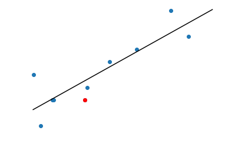

A number of years ago, I joined an (American) Fantasy Football League. It's in a format that means you roll players on year to year, and after a couple of fallow seasons I felt, coming into 2022 like I had rebuilt the side. I've scored fairly well, but I'm currently sitting 4-8 (4 wins to 8 defeats) and looking at missing the playoffs again. I'm currently sitting 7th (with 1701 points so far this year) while my playoff spot is occupied by a team with a 6-6 record and only 1501 points on the season. This state of affairs is made possible by the fact that rankings are assigned as week to week wins and losses and not total points. So the question is how likely is it that my point total would get me into the playoffs?

<figure>

</figure>

To illustrate the problem at bit more clearly, I've plotted the 10 league participants points totals against their number of wins. You can clearly see that I (the red) have come away with fewer wins than you might expect given my points total (ie. the red dot is below the black line corresponding an 'average' number of wins per points).

Approach one is a crude analytical solution. Each week of the fantasy football season 10 teams each get a score. This means that you are playing one of the 9 possible other scores. If you have the best score in the league, you'll win. If you have the second best score, you win on $$\frac{8}{9}$$ of occasions and so on. This then becomes something very close to a binomial picking problem. Now, in the interest of simplicity (and to give us an interesting baseline to compare against next time) we're going to neglect some quirks of playing actual fantasy football (in the first 9 weeks you play each team exactly once for example) and assume that 6 wins would be sufficient to make the playoffs (this may not actually be the case, as changing the schedule will change who wins which games). This means that we can save the simulations for another time.

The simplest calculation to perform is to figure out how likely it was I would have won every game, which is given by:

$$\prod_{i} \frac{n_{i}}{9}$$

where $$ n\_{i} $$ is my ranking in a given week $$r = (0,2,7,4,8,5,1,3,6,4,4,4)$$, which comes to a big fat duck egg (because I can never win in Week 1). You can extend this to solve the other win number cases, for example the probability of
getting exactly eleven wins from twelve games is:

$$\sum_{j} (1-\frac{n_{j}}{9}) \prod_{n_{i \neq j}}\frac{n_{i}}{9}$$

which follows from an elementary understanding of the rules of addition and summation of independent probabilities. The term inside the product is our $$ n-1 $$ wins, the term outside are our defeats. However, exploiting the fact that these are independent draws from Bernouli distributions means we can makes this process a bit simpler. Specifically, we use the fact that the distribution of sums of Bernouli distributions is the [Poisson binomial distribution](https://en.wikipedia.org/wiki/Poisson_binomial_distribution). While this isn't particularly easy to work with, but it's prevalent enough that there is a Python package to do the calculations for us. Below I've plotted the histogram of my expected wins given my weekly ranks. By simple summation we find that under this crude model I get to 6-6 or better in 45% of seasons and 5-7 nearly three quarter of the time. Still under the model this isn't a convincing playoff push. Next time I'll investigate if this number changes much as we drop some of assumptions (broadly allowing for strength of schedule and the variable barrier for entry to the playoffs), but for now I'll stick to feeling a little hard done by.

<figure>

<figcaption>The discrete probability distribution generated from selecting a random opponent each week and comparing their score to mine. While going 5-7 and 6-6 is more
likely than 4-8, results of 4-8 and worse still make up a significant fraction of the distribution (about 25%).</figcaption>

</figure>
