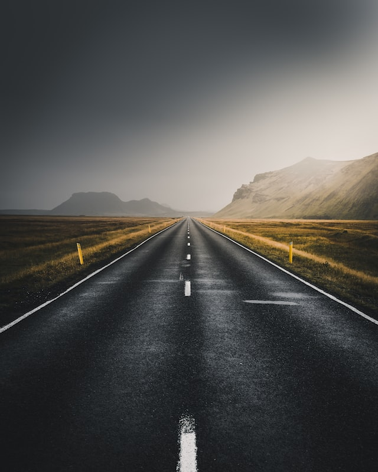

<link href="styles/style.css" rel="stylesheet" />

This is the website for the Cambridge based scientist, take a look around!

<!--

<button id="tech-button" type="button" onclick="displayTech()">Tech</button>

-->